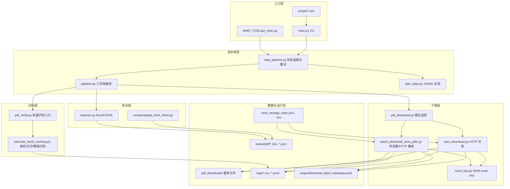

# 01. 项目整体架构

`PDF_DDD` 是一个本地运行的 WMS 面单下载与识别工具。它既支持命令行批处理，也有 `WMS_TOOL` Tkinter GUI 外壳，还提供 PowerShell 脚本注册 Windows 定时任务。

## 架构分层

## 入口层

### 命令行入口

`main.py` 是主要入口。它负责：

- 解析下载时间、仓库、状态、并发、识别、导出等参数。
- 解析 `wms_storage_state.json` 的实际路径。
- 调用 `tracked_download_pdf()`、`tracked_run_ocr()`、`tracked_extract_data()`。
- 在 PyInstaller 冻结可执行文件模式下，在退出前保留窗口。

### GUI 外壳

`WMS_TOOL/gui_main.py` 提供一个简单 Tkinter 桌面界面。它不重写业务逻辑，而是调用 `WMS_TOOL.task_runner.start_task()`，再由后台线程调用 `WMS_TOOL.worker.run_pipeline()`。

### PowerShell 脚本

`scripts/` 下的 `.ps1` 脚本用于生产化批处理：

- `run_hourly_batches.ps1`：按天拆成小时批次。
- `run_previous_hour_batch.ps1`：每次跑上一小时窗口。
- `run_window_batches_to_master.ps1`：按小时滚动，但持续追加到同一个总表。
- `register_hourly_batches_task.ps1`：注册每天/每周运行完整小时批次的 Windows 定时任务。
- `register_previous_hour_task.ps1`：注册上一小时滚动任务。

## 流水线层

流水线固定拆成三步：

1. `download_pdf`：下载面单或读取本地输入目录，写出 `01_download_manifest.json`。
2. `run_ocr`：读取下载清单，执行 PDF/图片识别，写出 `02_ocr_results.json`。
3. `extract_data`：读取识别结果，导出 Excel/JSON，写出 `03_extract_manifest.json`。

`task_pipeline.py` 在三步外面增加：

- 每步最多 3 次重试。
- 对每个文件生成稳定 `task_id`。
- 写入 `task_state.jsonl`，记录 `DOWNLOAD`、`OCR`、`EXTRACT` 阶段状态。
- 将 `download_file_error`、非 PDF、OCR 失败等异常转为任务状态。

## 下载层

默认下载模式是 `auto_download.py` 的 HTTP 并发下载。`pdf_download.run_download()` 会优先尝试 HTTP 并发模式，失败后在适用场景回退到 `batch_download_wms_pdfs.py` 浏览器兼容模式。

下载层核心职责：

- 使用 WMS 账号密码或已有登录态获取/刷新 token。
- 按时间、仓库、状态、物流渠道分页查询订单。
- 获取面单详情和下载 URL。
- 保存 PDF/图片面单到本地目录。
- 写入下载日志 CSV。
- 写入 metadata JSONL，供后续识别和导出补充业务字段。

## 识别层

识别层主要在 `barcode_verify_tracking.py`：

- 从 PDF 文字层提取追踪号候选。
- 用 `zxing-cpp` 反读条码。
- 支持图片面单和 PDF 面单。
- 根据追踪号前缀推断承运商。
- 识别特殊模板：`0024`、`CBT`、`CBS`。
- 比对下载来源、PDF 文字层、条码结果，输出状态。

`pdf_verify.py` 是批量适配层，负责加载下载日志、metadata 索引、zxing 引擎，并逐行调用 `process_row()`。

## 导出层

`exporter.py` 将 `VerifyResult` 转为业务表：

- `全部结果`
- `异常复核`
- `下载不一致`
- `统计汇总`
- `简略版`

导出时会读取历史 Excel 并按追踪号、文件路径、订单号或文件名去重合并，适合小时批次持续追加到总表。

