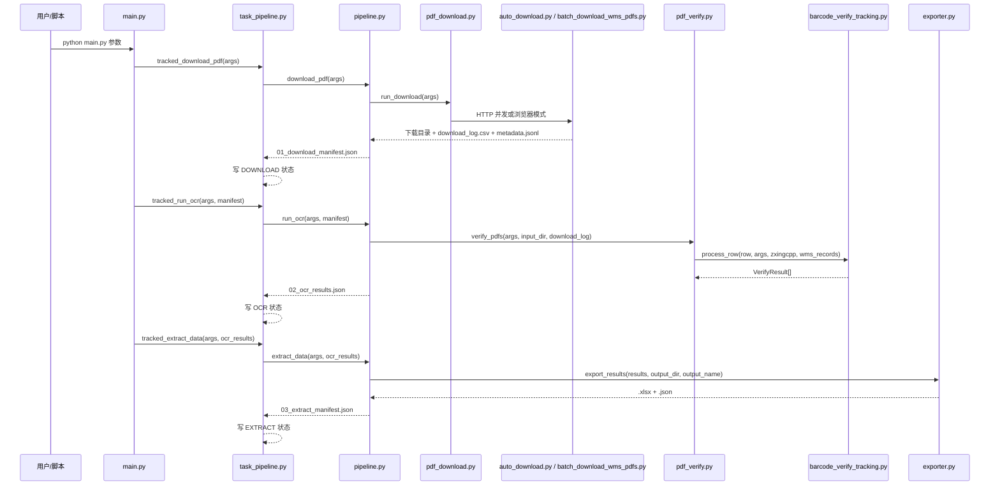
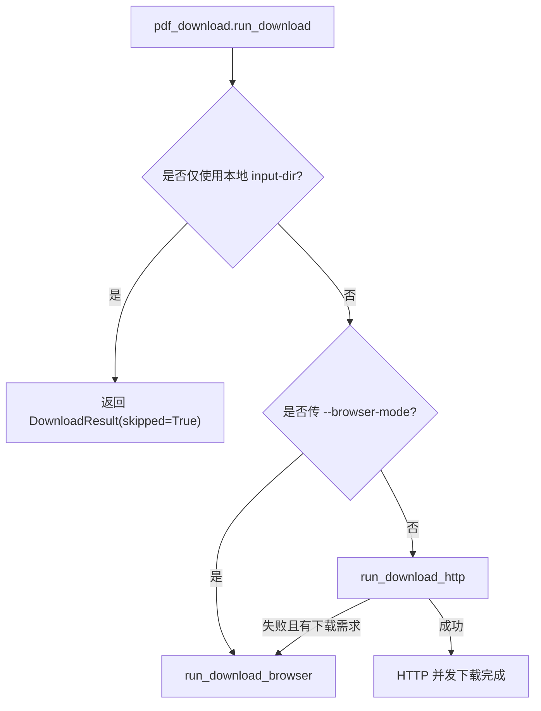

# 02. 运行流程与数据流

本文说明一次完整运行从参数输入到 Excel 输出的实际数据流。

## 主流程顺序



## 阶段 1：下载或读取输入

入口函数：`pipeline.download_pdf(args)`

当传入 `--input-dir` 且没有下载参数时，程序跳过 WMS 下载，直接扫描本地目录。支持后缀：

- `.pdf`
- `.jpg`
- `.jpeg`
- `.png`
- `.webp`
- `.tif`
- `.tiff`

当存在 `--start-time`、`--end-time`、`--wh-codes` 等下载参数时，程序调用 `pdf_download.run_download(args)`。

输出中间文件：

```text
<output-dir>/_intermediate/<output-name>/01_download_manifest.json
```

主要字段：

| 字段 | 说明 |
| --- | --- |
| `step` | 固定为 `download_pdf`。 |
| `input_dir` | 实际面单文件目录。 |
| `download_log` | 下载日志 CSV 路径。 |
| `skipped` | 是否跳过下载。 |
| `files` | 成功下载或扫描到的文件绝对路径。 |
| `tasks` | `task_pipeline` 追加的任务 ID 和文件路径映射。 |
| `task_state` | 任务状态 JSONL 路径。 |

## 阶段 2：识别与校验

入口函数：`pipeline.run_ocr(args, download_manifest_path)`

此阶段会：

1. 读取 `01_download_manifest.json`。
2. 设置 `args.input_dir` 和 `args.download_log`。
3. 调用 `pdf_verify.verify_pdfs()`。
4. 将 `VerifyResult` dataclass 转成 JSON。

输出中间文件：

```text
<output-dir>/_intermediate/<output-name>/02_ocr_results.json
```

识别过程的数据来源：

| 来源 | 用途 |
| --- | --- |
| 下载日志 CSV | 建立 WMS 订单号/追踪号与本地文件路径的关联。 |
| `metadata.jsonl` | 补充原始 WMS 字段、渠道、客户、仓库、源文件名、下载侧模板判断。 |
| PDF 文字层 | 提取追踪号、模板角标文本。 |
| 条码图片渲染 | 用 zxing 反读条码。 |
| 文件名 | 在低置信度或下载日志不足时辅助提取追踪号。 |

## 阶段 3：业务导出

入口函数：`pipeline.extract_data(args, ocr_results_path)`

此阶段会：

1. 从 JSON 恢复 `VerifyResult`。
2. 调用 `exporter.export_results()`。
3. 写出 Excel 和 JSON。
4. 写出 `03_extract_manifest.json`。

输出文件：

```text
<output-dir>/<output-name>.xlsx
<output-dir>/<output-name>.json
<output-dir>/_intermediate/<output-name>/03_extract_manifest.json
```

Excel sheet：

| Sheet | 说明 |
| --- | --- |
| `全部结果` | 业务字段明细，包含追踪号、承运商、面单类型、下载与内容比对、metadata 字段等。 |
| `异常复核` | 需要人工复核的行。 |
| `下载不一致` | 下载侧模板与内容识别模板不一致的行。 |
| `统计汇总` | 总数、自动通过数、复核数、模板统计、承运商统计等。 |
| `简略版` | 面向快速查看的列集合：追踪号、承运商、面单类型、内容识别类型、比对备注、物流渠道名称。 |

## 下载模式选择



默认优先使用 HTTP 并发模式。浏览器模式主要用于首次登录、排查 WMS 页面行为或 HTTP 登录态失效后的兼容路径。

## 状态流

`task_state.jsonl` 每行是一条状态事件：

```json
{
  "task_id": "...",
  "file_path": "...",
  "stage": "OCR",
  "status": "OCR_DONE",
  "error_type": "",
  "error_msg": "",
  "timestamp": "2026-06-18T00:00:00"
}
```

常见阶段：

- `DOWNLOAD`
- `OCR`
- `EXTRACT`

常见状态：

- `CREATED`
- `DOWNLOADED`
- `OCR_DONE`
- `EXTRACT_DONE`
- `FAILED`

常见错误类型：

- `DOWNLOAD_FAILED`
- `NOT_PDF`
- `OCR_FAILED`
- `PARSE_FAILED`

