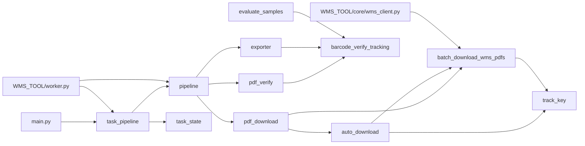

# 05. 依赖关系与数据文件

## Python 依赖

`requirements.txt` 当前依赖：

| 包 | 用途 |
| --- | --- |
| `PyMuPDF` | 读取 PDF 文字层、渲染 PDF 页面。代码中以 `fitz` 导入。 |
| `openpyxl` | 读写 Excel。 |
| `zxing-cpp` | 条码反读核心库。 |
| `Pillow` | 图片处理、裁剪、增强。 |
| `requests` | 常规 HTTP 请求。 |
| `curl_cffi` | 更接近浏览器 TLS/HTTP 行为的请求客户端，用于 WMS。 |
| `pypdf` | 下载后 PDF 格式校验。 |
| `playwright` | 浏览器兼容模式、登录态管理。 |
| `pyinstaller` | Windows 可执行文件打包。 |
| `pytesseract` | 可选 OCR 能力，需要系统额外安装 Tesseract。 |

## 内部模块依赖



## 运行目录

| 路径 | 类型 | 说明 | 是否提交 |
| --- | --- | --- | --- |
| `.env` | 本地配置 | WMS 账号密码等环境变量。 | 否 |
| `.env.example` | 示例配置 | 环境变量示例。 | 是 |
| `wms_storage_state.json` | 登录态 | Playwright/WMS 登录态，本机运行态。 | 否 |
| `logs/` | 运行日志 | 下载日志、任务状态、PDF 校验日志。 | 否 |
| `pdf_downloads/` | 下载结果 | WMS 面单文件。 | 否 |
| `output/pdf/` | 导出结果 | Excel/JSON 输出。 | 否 |
| `output/download_label_metadata.jsonl` | metadata | 下载阶段和导出阶段的业务字段桥梁。 | 通常否 |
| `samples/` | 样本 | 面单模板识别样本。真实 PDF 通常不提交。 | 视情况 |
| `build/`, `dist/` | 构建产物 | PyInstaller 输出。 | 否 |
| `WMS_TOOL/config/default.json` | GUI 默认配置 | GUI 参数默认值。 | 是 |

## 下载日志 CSV

下载日志默认字段：

| 字段 | 说明 |
| --- | --- |
| `deliveryNo` | WMS 出库单/交付单号。 |
| `sourceNo` | 来源单号或波次相关字段。 |
| `expressNo` | WMS 记录中的物流追踪号。 |
| `customerCode` | 客户代码。 |
| `whCode` | 仓库代码。 |
| `status` | 下载状态，例如 `success` 或 `failed`。 |
| `filePath` | 本地保存的面单路径，多个文件用 `|` 拼接。 |
| `error` | 失败原因。 |
| `downloadedAt` | 下载时间。 |

`pipeline.files_from_download_log()` 只读取 `status=success` 的行。

## metadata JSONL

metadata JSONL 是下载阶段写出、识别/导出阶段读取的关键数据。默认位置：

```text
output/download_label_metadata.jsonl
```

GUI 模式会通过环境变量指定到本次运行日志目录：

```text
PDF_DDD_METADATA_JSONL=<logs>/<run_name>_metadata.jsonl
PDF_DDD_METADATA_SUMMARY=<logs>/<run_name>_metadata_summary.xlsx
```

常用字段类别：

| 字段类别 | 示例 | 用途 |
| --- | --- | --- |
| 文件映射 | `file_path`, `file_name`, `delivery_no` | 将识别结果和下载订单关联。 |
| 原始 WMS 字段 | `source_fields.fileName`, `source_fields.logisticsChannelName` | 判断源文件格式、导出物流渠道名称。 |
| 业务字段 | `customer_code`, `wh_code`, `channel_hint` | 导出客户、仓库、渠道。 |
| 下载侧识别 | `recognized_template`, `recognized_carrier` | 与内容侧识别结果比对。 |

重要规则：

- `source_fields.logisticsChannelName` 是导出 `物流渠道名称` 的优先来源。
- 原始 `source_fields.fileName` 可用于判断来源是否真的是 PDF。
- 即使本地文件名以 `.pdf` 结尾，也不能只靠本地文件名判断源文件格式。

## 中间文件

中间文件目录：

```text
<output-dir>/_intermediate/<output-name>/
```

| 文件 | 说明 |
| --- | --- |
| `01_download_manifest.json` | 下载阶段输出，包含输入目录、下载日志和文件列表。 |
| `02_ocr_results.json` | 识别阶段输出，包含 `VerifyResult` 列表。 |
| `03_extract_manifest.json` | 导出阶段输出，包含 Excel/JSON 路径和结果数量。 |
| `task_state.jsonl` | 任务状态流水。 |

这些文件便于断点排查：下载、识别、导出哪一步失败，可以直接定位。

## Excel 输出结构

### `全部结果`

核心列包括：

- 订单号
- 追踪号
- 文件名
- 文件路径
- 承运商
- 面单类型
- 模板细分
- 内容识别类型
- 下载侧类型
- 下载与内容是否一致
- 是否人工复核
- 最终状态
- 内部状态
- 条码追踪号
- PDF 文字层追踪号
- 文件名追踪号
- 下载订单号
- 下载仓库
- metadata 承运商/渠道/客户代码
- 物流渠道名称

### `异常复核`

来自 `need_review=True` 的行。

### `下载不一致`

来自 `template_compare_match is False` 的行。

### `统计汇总`

统计维度：

- 总文件数
- 自动通过数量
- 需要复核数量
- 条码识别成功数量
- OCR 触发数量
- 下载与内容一致/不一致数量
- 按承运商统计
- 按面单类型统计
- 按下载侧类型统计
- 按模板细分统计

### `简略版`

列集合：

- 追踪号
- 承运商
- 面单类型
- 内容识别类型
- 下载与内容对比备注
- 物流渠道名称

## 识别状态

强通过状态：

| 状态 | 含义 |
| --- | --- |
| `auto_pass_triple_verified` | 下载来源、PDF 文字层、条码三方一致。 |
| `auto_pass_barcode_verified` | 条码与下载来源一致。 |
| `auto_pass_text_verified` | PDF 文字层与下载来源一致。 |
| `auto_pass_verified_prefix` | USPS 特殊情况，文字层有粘连数字但前缀匹配。 |

复核或异常状态：

| 状态 | 含义 |
| --- | --- |
| `source_only_low_confidence` | 只有下载来源可用，条码/文字层未验证。 |
| `review_conflict` | 多来源追踪号冲突。 |
| `review_unknown` | 无可靠追踪号。 |
| `barcode_failed` | 条码反读失败。 |
| `image_ocr_detected` | 图片面单识别到信息，但需要人工复核。 |
| `ocr_needed` | 需要 OCR 深度识别。 |
| `download_file_error` | 下载文件异常、格式不支持或来源非 PDF。 |

## 安全与提交规则

不得提交：

- `.env`
- WMS 账号密码
- `wms_storage_state.json`
- `.wms_token_cache.json`
- 下载日志和业务数据
- PDF/图片面单
- Excel/JSON 业务输出
- `build/`、`dist/`、`__pycache__/`

可以提交：

- 源码
- `.env.example`
- 文档
- 不含真实业务数据的测试样例或说明
- `requirements.txt`
- PyInstaller `.spec`

