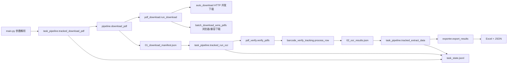

# PDF_DDD Code Wiki

本 Wiki 面向后续开发、维护和代码审查，说明 `PDF_DDD` 仓库的整体架构、运行链路、模块职责、关键类与函数、依赖关系和常用运行方式。

项目核心目标：从 WMS 拉取出库面单文件，识别条码、追踪号、承运商和面单模板类型，再结合下载 metadata 导出可复核的 Excel/JSON 结果。

## 页面导航

- [01. 项目整体架构](01-architecture.md)
- [02. 运行流程与数据流](02-runtime-flow.md)
- [03. 主要模块职责](03-modules.md)
- [04. 关键类与函数说明](04-key-classes-functions.md)
- [05. 依赖关系与数据文件](05-dependencies-and-data.md)
- [06. 运行、部署与维护手册](06-runbook.md)

## 快速代码地图

| 区域 | 代表文件 | 说明 |
| --- | --- | --- |
| 主入口 | `main.py` | 命令行入口，解析参数并串起三阶段流水线。 |
| 流水线编排 | `pipeline.py`, `task_pipeline.py`, `task_state.py` | 下载、识别、导出三步，以及任务状态 JSONL 追踪。 |
| WMS 下载 | `pdf_download.py`, `auto_download.py`, `batch_download_wms_pdfs.py` | HTTP 并发下载、浏览器兼容模式、登录态与 metadata 写入。 |
| 识别校验 | `pdf_verify.py`, `barcode_verify_tracking.py` | 文件加载、条码反读、PDF 文字层解析、模板识别、状态判定。 |
| 业务导出 | `exporter.py`, `scripts/update_brief_sheet.py` | 生成 Excel/JSON，合并历史结果，维护简略版 sheet。 |
| GUI 外壳 | `WMS_TOOL/` | Tkinter 桌面工具，对核心流水线进行参数封装和后台任务管理。 |
| 批处理脚本 | `scripts/*.ps1` | 按小时、上一小时、时间窗口总表、Windows 定时任务注册。 |

## 当前主流程

## 重要约定

- `.env`、`wms_storage_state.json`、日志、下载 PDF、Excel 输出、metadata 业务数据属于本地运行态或敏感数据，不应提交到 Git。
- `0` 在下载分页参数中表示不限量，例如 `--limit 0`、`--max-pages 0`、`--total-limit 0`。
- `output/download_label_metadata.jsonl` 是下载阶段和导出阶段之间的关键桥梁，导出物流渠道名称、客户、仓库、源文件名等字段时会依赖它。
- 对原始 WMS 来源不是 PDF 的面单，识别层会走 `download_file_error` 异常路径，进入人工复核。

